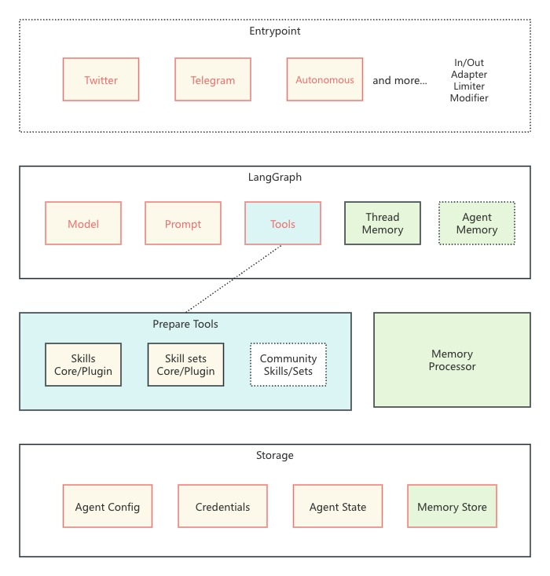

# IntentKit Architecture

## Overview

IntentKit is built with a modular architecture that separates concerns into distinct components:

## Components

### Entrypoint Layer
The entrypoint layer serves as the interface between the outside world and the Agent. It provides various integration points including Twitter and Telegram, along with autonomous execution capabilities. This layer includes adapters to handle input/output transformations, rate limiting, and modifications to ensure smooth communication between external services and the internal system.

### LangGraph Layer
At the heart of IntentKit lies the LangGraph layer, which orchestrates the AI processing pipeline. It manages the language model interactions, prompt engineering, and tool execution flow. The layer maintains both thread-specific memory for ongoing conversations and a broader agent memory system, enabling contextual awareness and persistent knowledge across interactions.

### Processing Layer
Skills and Memory Runtime

### Storage Layer
The storage layer provides persistent data management across the system. It maintains agent configurations, securely stores credentials, preserves agent state information, and manages the memory store. This layer ensures that all persistent data is properly organized, secured, and readily accessible when needed.

## The Flow

## Key Design Decisions

1. **Agent Caching**
   - Agents are cached in memory for performance
   - Cache is invalidated on configuration changes

2. **Tool Management**
   - Tools are loaded dynamically based on agent configuration
   - Each tool is isolated and independently maintainable

3. **Error Handling**
   - Graceful degradation on tool failures
   - Comprehensive logging for debugging
   - Quota management to prevent abuse

4. **State Management**
   - PostgreSQL for persistent storage
   - In-memory caching for performance
   - Transaction management for data consistency
